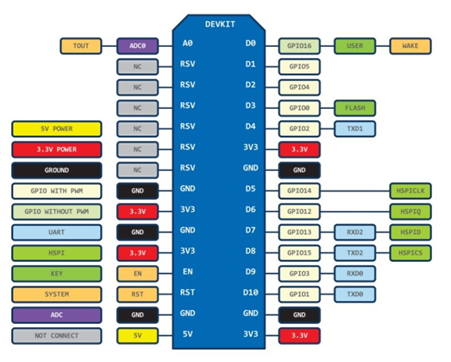
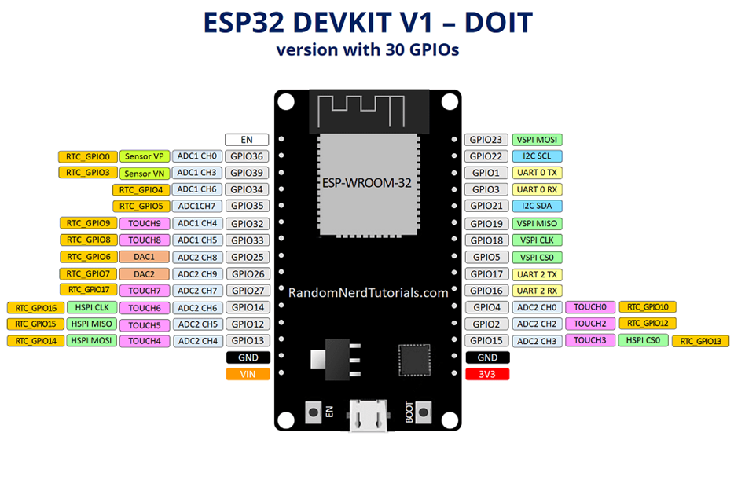

Guia Básico
------------

SDK ESP é o kit de desenvolvimento de software pra os projetos relativos a Automação-IOT, baseados no hardware ESP8266 ou ESP32 Nodemcu.  
Este SDK foi baseado no projeto MicroPython (http://micropython.org/). 

.. _ESP8266:

ESP8266
~~~~~~~

ESP8266 é um módulo WIFI de baixo custo, adequado para projetos de micontroladores, totalmente reprogramável. 
Possui como lista de recursos, os seguintes itens:

 - Protocolo 802.11 b/gn
 - Wi-fi direct (P2P)
 - Pilha de protocolo TCP/IP integrado
 

.. _Pinagem ESP8266:

Pinagem ESP8266
~~~~~~~~~~~~~~~

Pinagem :
	
====== ======  
 PINO   GPIO
------ ------ 
  D0     16          
  D1	 05 
  D2     04 
  D3     00
  D4     02
  D5     14
  D6     12
  D7     13
  D8     15
  D9     03
  D10    01  
====== ====== 

.. _ESP32:

ESP32
~~~~~

- Protocolo 802.11 b/gn
- WiFi: 2,4 GHz, 802.11 b/g/n
- Bluetooth: Bluetooth Low Energy v4.2 (BLE)
- 1  Sensor de temperatura interno
- 1 Sensor de efeito Hall

Pinagem ESP32
~~~~~~~~~~~~~

.. _Projeto MicroPython:

Projeto MicroPython
~~~~~~~~~~~~~~~~~~~

Projeto Micropython, que possui como foco principal a implementação do Python 3.X em pequenos sistemas embarcados.

.. _MicroPython: 

.. image:: ../imagem/micropython.jpg
    :align: center